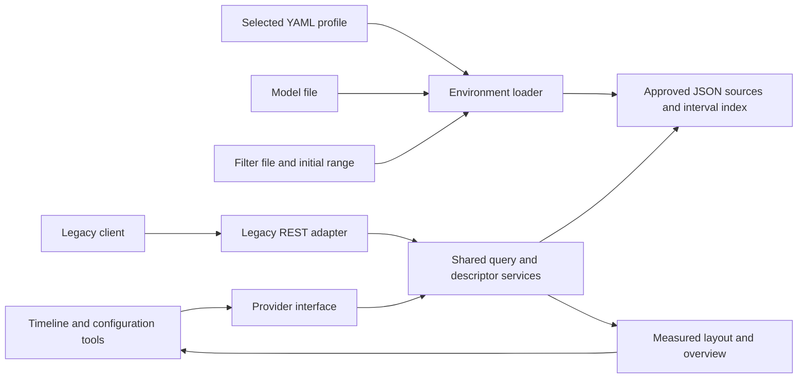

# OpenBEXI Timeline 2.0 — architecture

Updated: 2026-09-20. Implementation baseline for the
[current prompt](../openbexi_timeline2.0_current_prompt.md). Performance release
targets remain qualification gates, not a claim inferred from feature completion.

## Retain the working foundation

The current server uses Python, FastAPI, Uvicorn and ordinary JSON files. The
browser uses JavaScript and Three.js. Node/esbuild builds the standalone client.
Local and server providers share validated record, filter, model and layout
contracts. The local worker owns an in-memory snapshot; the server owns immutable
query/layout results and application state. Keep these boundaries.

The simplification adds a clear file-based environment loader and a legacy HTTP
adapter, and reduces the visible shell. It does not require a new database,
framework, duplicate renderer or a Java runtime inside the Python process.

## REST API and OpenAPI/Swagger

Retain a documented REST interface for the timeline and configuration tools.
The implemented native base is `/api/v1/workspaces/default`; the authoritative
contract is generated from registered FastAPI handlers and shared schemas as
OpenAPI 3.1.1 with the JSON Schema 2020-12 dialect. The checked-in
[shared/openapi.json](../shared/openapi.json) supplies the offline Help viewer.

| Current interface | Purpose |
| --- | --- |
| `GET /api/v1/health` | Public health information |
| `GET /api/v1/workspaces/default/status` | Authenticated workspace/source state |
| `POST /api/v1/workspaces/default/query-sessions` | Prepare a time-domain query with filters/search and immutable result identity |
| `POST /api/v1/workspaces/default/date-availability` | Read authorized source date bounds and nearby recorded instants for an empty view |
| Query-session subresources | Read overview/density and query records; prepare measured layouts and traverse their rows |
| Workspace record/model/configuration resources | Inspect or modify authorized managed resources, subject to capabilities and concurrency rules |
| `GET /api/v1/workspaces/default/openapi.json` | Authenticated live specification for registered routes |

Date availability respects the authorized and selected source intersection,
including saved-filter source restrictions. Content/search predicates do not
change these source hints. A cached interval lookup serves repeated requests;
partitioned archives reuse their disposable index and report incomplete coverage
explicitly. Local snapshots provide the same navigation semantics offline.

The [detailed API guide](reference/implementation/api.md) and generated contract
define exact payloads, methods, statuses, authentication, revision checks and
pagination. Do not infer mutation support from an endpoint name or from a static
Swagger page; legacy-source mode and permissions can prohibit an operation.

**Swagger access is in Help → Developer docs → Swagger (offline).** Its assets
and specification are bundled, with request execution disabled. Live API obtains
the active server contract through the authenticated provider and displays JSON.
The default FastAPI `/docs`, `/redoc` and `/openapi.json` routes are disabled in
`create_app`; do not document them as available server pages.

Keep native REST and the legacy compatibility adapter distinct. Its registered
routes are in OpenAPI with contract tests. Document SSE stream
events, reconnect/cancellation and error behavior separately from ordinary JSON
responses. Continuous navigation, dynamic grouping, filters and descriptors must
share query semantics across native, compatibility and Local providers.

For each implemented operation, publish its method/path, parameters/body schema,
success/error examples, authentication, read/write capability, time-boundary rules
and any cursor/revision requirements. Regenerate and check the bundled contract
when routes or schemas change. The implemented compatibility routes are included
in the generated contract with their supported request and authentication rules.

## Target server flow

The diagram describes the target server path. Standalone mode continues to use
the local provider with a complete snapshot and no server filesystem access.

## Source audit of the legacy interface

The following observations come from the local source checkout, not a live HTTP
capture. All legacy paths below are relative to `C:\projects\openbexi_timeline`.

| Source | Observed responsibility |
| --- | --- |
| `src/com/openbexi/timeline/server/openbexi_timeline.java:170,188,218` | Registers session and SSE servlet mappings |
| `src/com/openbexi/timeline/servlets/ob_ajax_timeline.java:21,46,75` | Session route, GET window dispatch and POST action dispatch |
| `src/com/openbexi/timeline/servlets/ob_sse_timeline.java:45` | GET streaming/action dispatch |
| `src/com/openbexi/timeline/servlets/ob_handle_http_requests.java` | Headers, descriptors, filter operations and source dispatch |
| `src/com/openbexi/timeline/data_browser/data_configuration.java:52` | Reads request parameters |
| `src/com/openbexi/timeline/data_browser/json_files_manager.java:81` | Reads partitions, filters and merges the legacy events envelope |
| `src/openbexi_timeline.js:582,1142,4684` | Constructs filter/descriptor requests and loads requested date windows |
| `filters/default_filter_setting.json` | Legacy saved-filter envelope, ALL/BY_NAMESPACE and `start: current_time` |
| `tests/yaml/sources_default_test.yml`, `tests/models/regular_timeline.json` | SOURCE1/SOURCE2 configuration and presentation examples |

### Legacy compatibility surface

| Method/path | Inputs observed in source | Response/behavior to qualify |
| --- | --- | --- |
| `GET /openbexi_timeline/sessions` | `startDate`, `endDate`, `scene`, `namespace`, `filterName`, `filter`, `search`, `timelineName`, `userName` | UTF-8 JSON with `dateTimeFormat`, `scene`, `events`; session activities remain nested |
| `POST /openbexi_timeline/sessions?ob_request=readDescriptor` | `event_id`, `start`, `namespace`, plus client context | Legacy descriptor representation; handler also has an SSE response branch |
| `POST /openbexi_timeline/sessions?ob_request=readFilters` | Timeline, user, scene and filter context | Legacy saved-filter representation |
| Same POST route with `updateFilter`, `addFilter`, `deleteFilter`, `saveFilter` | `filterName`, `filter`, `sortBy`, title, presentation and user/context parameters | Validated configuration operation with compatible response |
| Same POST route with `addEvent` | Legacy event and window fields | Writable-source operation only; never enable writes to read-only archives |
| `GET /openbexi_timeline_sse/sessions` | Window/context parameters and optional `ob_request` | `text/event-stream` frames containing legacy JSON; closing/replacing streams on navigation |

The browser mentions `updateEvent` and `deleteEvent`, but the inspected AJAX
dispatcher only explicitly handles `addEvent` for event mutation. Do not claim
those other writes are implemented without additional handler/runtime evidence.
The SSE servlet also accepts action requests over GET; compatibility for any
mutation must preserve authorization and read-only restrictions, not reproduce
unsafe side effects merely because an old client can request them.

The client concatenates date strings into query parameters; Java code uses legacy
date parsing and special current-time handling. Capture the actual accepted UTC
spellings, percent encoding, empty/null parameters and response examples in
fixtures before claiming wire compatibility. Use strict normalized instants
internally. The JSON manager emits an `events` envelope; it is not the new
canonical snapshot or a query-layout page.

The legacy header handler permits wildcard CORS and has dummy/error responses.
These are observed behavior, not blanket requirements to copy. Preserve current
authorization, explicit origin policy and meaningful error reporting. Record any
necessary client-visible difference and test it with the legacy client.

## Adapter responsibilities

Add the legacy routes as a thin translation layer over existing source, query,
filter and descriptor services. Keep `/api/v1/...` available for the current
client. Today's [OpenAPI artifact](../shared/openapi.json) describes the current
Python API and the registered legacy routes above.

The adapter must normalize request dates and source/filter references, invoke the
same authorized query service, and serialize the expected legacy envelope. Return
all admitted matches for the requested interval, not only the first visible row
page. Apply explicit request-size limits with useful errors rather than silent
truncation. Keep full exports separate from window requests.

Legacy user/timeline parameter strings identify configuration context; they do
not grant access. Descriptor lookups use approved source identities and known
paths. Unsupported converters, connectors and filters fail explicitly.

## Continuous past/future loading

1. Resolve and validate the selected YAML/model/filter before activation. Compute
   a fresh opening interval using the filter and model rules.
2. Serve the application and source metadata without reading every archive payload
   synchronously. Request the visible window first.
3. Read relevant date partitions and files whose indexed actual intervals overlap
   the window. Include sessions beginning before the requested date.
4. Publish a consistent query, measured layout and descriptor context. Keep a
   stable source generation/revision for its row pages.
5. Prefetch adjacent intervals with directional priority. Deduplicate requests,
   bound converted-file caches and prioritize foreground navigation over prefetch.
6. Load the broader overview separately. Keep its selection synchronized without
   using its aggregation as a substitute for the main window's records.
7. On a new navigation intent, cancel replaceable work and reject stale responses
   by request/source identity. Do not let a late response move the timeline back.
8. Continue background indexing and periodic source checks. Refresh explicitly or
   in follow-now mode; do not replace a historical view just because indexing ends.

An arbitrary long session in an unindexed old file cannot be discovered from the
folder date alone. Retain the existing disposable interval index and provisional
coverage state. Background indexing is compatible with “no full archive load at
startup”; blocking the first view on a complete scan is not.

Current defaults are a 25% window buffer, 64 MiB converted-file cache and 30-second
index refresh. The validation profile uses a zero buffer for a reproducible comparison window. Expose advanced
loading settings in YAML, not as mandatory controls on the timeline toolbar.

Navigation must remain possible through empty, unavailable and future intervals.
Show empty data only for successful empty reads; retain confirmed visible data
with an error on failed replacements. No synthesized future events or automatic
fallback to demonstration data.

## Data ownership and saved state

Keep legacy archives read-only. Cache/index/preferences/state directories must be
separate from source roots. Retain single-writer ownership, atomic validated
commands, idempotency, revision conflict checks, backup and recovery behavior for
writable application state. Simplifying UI does not remove these protections.

Generated environment definitions become portable file inputs. Existing runtime
model/filter catalogs remain compatible through adapters and explicit migration.
Do not introduce two conflicting authorities for the same saved configuration.
Opening a profile should show which files supplied the effective model/filter.

## Implementation readiness review

The 2026-09-20 review supports incremental implementation on the current foundation.
Immutable query results, bounded background workers, stale-response checks, local
worker isolation and resource-release tests are useful building blocks. The review
covered configuration resolution, loading/query preparation, grouping, rendering
and their focused tests; it is not certification of every code path or supported
scale. The table preserves findings from the documentation checkpoint; the
implementation status immediately below records the resulting changes.

| Priority | Finding and impact | Recommended change |
| --- | --- | --- |
| High | [Current layout grouping](../client/src/timeline/layout-presentation.js) assigns each record by its own metadata and sorts group values. This can separate activities from their parent and differs from legacy encounter order | Add an explicit legacy family-grouping policy in both Local and Python paths. Define stable encounter ordinals from source order, relative file path and record position, independent of asynchronous completion |
| High | [Grouping choices](../client/src/app.js) and the [configuration catalog](../client/src/data/configuration-catalog.js) do not provide the required inventory of observed JSON fields | Discover eligible fields before pagination for a declared source/filter/time scope; cache by scope and source revision, bound work, report partial coverage and keep unrelated prefetch out of the active inventory |
| High | [Configuration resolution](../server/app/models/configuration_catalog.py) can apply saved view/model/filter pins; the new YAML entry point needs an explicit precedence contract | For version 2, make the selected YAML model/filter authoritative on fresh launch. Restore a saved view explicitly; make repeated unchanged file imports idempotent and preserve immutable versions |
| High | [Source identities](../server/app/services/legacy_sources.py) are derived from namespace and logical path; friendly IDs in new examples must not replace canonical identity accidentally | Specify aliases or migration mappings and verify stable record IDs, descriptors, selection and saved references across version-1/version-2 launches |
| High | [Window capture](../server/app/repositories/partitioned_legacy_repository.py) holds a foreground mutex; prefetch calls the same full capture, while [reader scans](../server/app/services/legacy_reader.py) hold another mutex. Slow background work can delay navigation and cancellation | Add cancellable lock admission and foreground priority between bounded file chunks. Prefetch reusable file data without preparing a second full query; exercise concurrent export/index reads too |
| High | [Query preparation](../server/app/services/query_preparation.py) reserves captured window resources after capture has allocated them. Reader input/cache byte limits do not equal Python heap or process RSS limits | Admit incremental capture allocations before retaining them, budget reader/index memory, and measure peak process memory with concurrent work. Keep the existing retained-object resource ledger |
| Medium | Every window examines index entries across selected sources; refresh revisits unchanged files and advances/persists index state | Use per-source interval lookup with parsed bounds. Separate check timestamps from content revisions, reuse unchanged summaries and persist only relevant changes; preserve provisional coverage and long-session discovery |
| Required before parity | Legacy fetch/EventSource requests do not send the current API's authentication headers; the renderer currently supports only Orthographic camera behavior | Qualify an authenticated transport shim or bridge before claiming legacy wire compatibility. Implement Perspective projection, aligned labels and hit testing before claiming a working 3D control |

Resolve two more contracts before coding: reference-time resynchronization should
explicitly restore a fixed `initial_range`'s bounds, with Now remaining a separate
action; environment generation should stage immutable model/filter/data versions
and activate them through one atomic YAML replacement. Replacing four independent
paths in succession is not an atomic environment save. Test failure at each stage.

Preserve viewport culling, bounded row pages and the inexpensive drag preview.
Measure renderer mesh/material and label rebuilding before introducing pooling or
instancing. Reuse the existing Timeline/Table/Split state and queries when retaining
those controls in the main toolbar. Establish performance with the
[qualification gates](openbexi_timeline2.0_tests.md#efficiency-qualification), not
with the apparent speed of a small screenshot fixture.

### Implementation status after authorization

Version-2 launch resolves explicit model/filter files, stable source aliases and
immutable imported publications. Query-scoped metadata discovery and explicit
parent-family/encounter-order policies run in both providers. The toolbar implements
overview, true camera switching, reference reset and primary view modes. Generator
exports include coordinated configuration/data and atomic YAML activation.

Loading now uses per-source interval lookup, cancellation-aware lock waits,
per-file prefetch priority and unchanged-refresh suppression. Full export yields
between files to waiting foreground reads. Reader cache limits use conservative
Python heap estimates, and selected records are admitted before snapshot duplication.
These are bounded capture/cache policies, not a hard process RSS guarantee:
parsing/converting one file, validation and concurrent queries also consume memory.
Keep the release memory measurements in the acceptance plan.

Legacy GET/POST/SSE routes use the same authorized query and configuration services.
Window envelopes include all admitted pages, nested activities and explicit
coverage. Limits are 10,000 records and 8 MiB per window. The five-second SSE lease
reconnects for fresh data with bounded streams and send timeouts. The
[transport instructions](openbexi_timeline2.0_deployment.md#connect-an-existing-legacy-browser-client)
explain why header-capable fetch is required. Search uses native contextual grammar;
ambiguous legacy predicates are rejected, and writes require canonical command
bodies plus generation/revision/idempotency preconditions. These are deliberate
compatibility boundaries, not claims of unchanged parameter-only client behavior.

Restricted principals need a launch filter whose source pins are within their
authorized scope. An all-sources launch filter is rejected for a principal that
can read only a subset; it is not silently rewritten. Source aliases and styles
are projected to the authorized scope before returning metadata.

## Implementation sequence and ongoing qualification

The legacy Sort by menu also needs a metadata-discovery adapter: `build_model`
and `ob_get_all_sorting_options` derive choices from record data; applying one
creates bands through `create_new_bands`/`update_timeline_model`. Resolve eligible
field inventories and parent-family grouping before display pagination, with
matching Local/Python behavior, bounded loading and source-revision invalidation.
Use safe field paths, retain legacy encounter order, and keep this contract separate
from table sorting. See [data design](openbexi_timeline2.0_data_design.md#dynamic-grouping-field-discovery)
and the [source audit](openbexi_timeline2.0_user_manual.md#what-the-legacy-code-actually-does).

1. Settle the contracts above; add version-2 schemas, profile/model/filter resolution
   and version-1 migration with stable identities and precedence tests.
2. Implement query-scoped field discovery, parent-family grouping and deterministic
   encounter order, with Local/Python parity before visual changes.
3. Improve loading admission, cancellation and interval lookup; measure navigation
   while prefetch, indexing and exports are active.
4. Add authenticated legacy REST/SSE fixtures and the shared-service adapter;
   qualify continuous navigation and stale-response handling through those routes.
5. Simplify the shell while retaining Timeline/Table/Split; implement and verify
   each legacy toolbar action, camera and responsive layout.
6. Add atomic environment generation and migrate built-in model/filter files,
   preserving source IDs and validating emitted YAML.
7. Run correctness, screenshot and supported-scale acceptance in
   [tests](openbexi_timeline2.0_tests.md). Record misses before claiming completion.

Relevant current code: [application](../server/app/main.py),
[partitioned repository](../server/app/repositories/partitioned_legacy_repository.py),
[query service](../server/app/services/query.py), [client](../client/src/app.js),
[providers](../client/src/data), [generator](../tools/event-generator/README.md).
