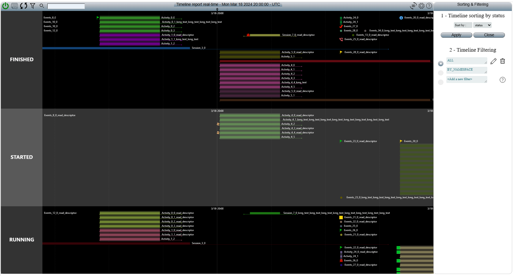
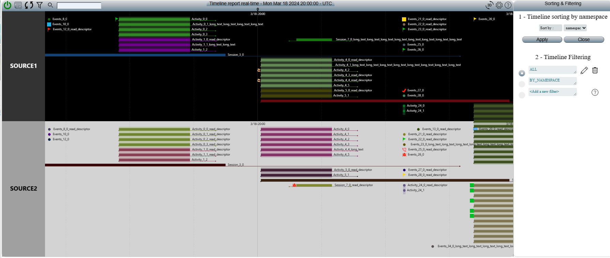
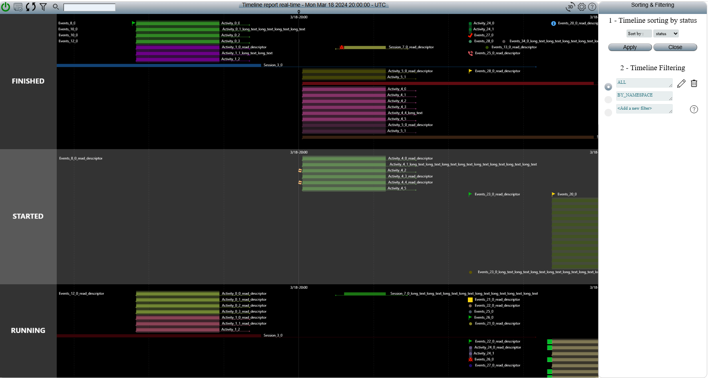
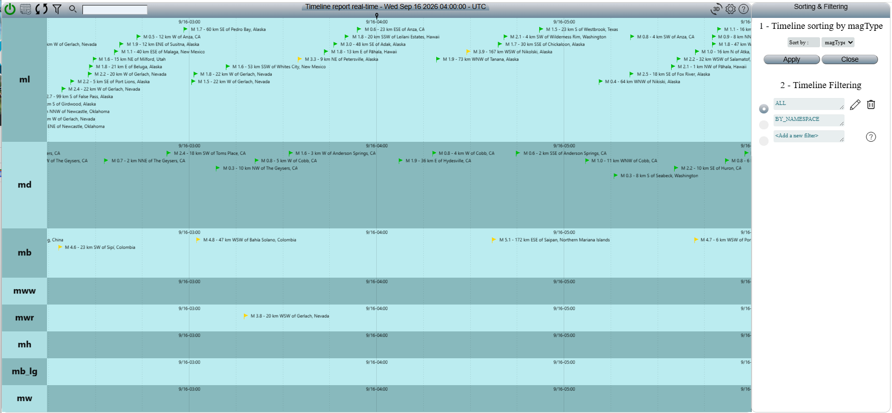
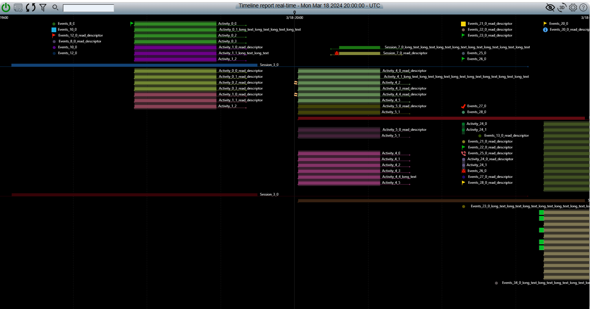

# OpenBEXI Timeline 2.0 — user manual

Updated: 2026-09-20. The compact toolbar, file-based environments and dynamic
grouping are implemented. Supplied images remain the user's reference; current
browser verification and compatibility limits are recorded in the test guide.

## Open the validation datasets

From the project directory, run:

```powershell
python scripts/start.py -- --yaml yaml/default_test.yml
```

Open the printed URL. The launcher prepares dependencies and builds the client.
The profile reads these existing directories without modifying them:

- `C:\projects\openbexi_timeline\tests\data\SOURCES1`
- `C:\projects\openbexi_timeline\tests\data\SOURCES2`

The actual folder names are **SOURCES1/SOURCES2**, not SORCES1/SORCES2. Both
have `2024/03/18/events.json`. The source namespaces are `SOURCE1` and `SOURCE2`.
The profile uses paths relative to the adjacent legacy checkout, so another
checkout location can use the same layout. Both sources must be enabled.

The comparison window is **March 18, 2024, 19:00–21:00 UTC**, centered at 20:00.
This is an explicit historical validation range; new environments still default
to current time when their filter has no `initial_range`. The version-2 test profile
selects `models/legacy_test.json` and `filters/legacy_test.json`. Version-1 profiles
retain their existing YAML `loading.initial_range` behavior.

## Main toolbar


Keep one compact horizontal toolbar with the same order and recognizable symbols.
The left side contains connection/user, calendar, current time, filter, search
icon and search input. The center shows the title, inspected date/time and timezone,
with the time marker below. The right side adds Timeline/Table/Split before
overview, 2D/3D, settings and help. Preserve the silver/blue appearance shown in the reference. Secondary tools
belong inside panels, without displacing these controls.

| Control | What you can do in the legacy interface | Required result in 2.0 |
| --- | --- | --- |
| Power / connection indicator | See connected/disconnected state; click to open the user panel, save name/email and reload that user's filters | Preserve status and user/preferences access. This button is not a server shutdown command; a saved display name does not grant server permissions |
| Calendar | Browse dates and jump the timeline to the selected day; its panel also has title, start/end, description and icon fields for adding an event/session | Preserve date navigation and the creation workflow on a writable workspace; the read-only test archives stay protected |
| Circular arrows | Resynchronize to the configured reference time: now for `current_time`/`Date.now()`, the configured date for a fixed-date model | Preserve both cases for legacy profiles. For version 2, use the filter-owned initial reference, defaulting to now when omitted; explicitly distinguish resynchronization from a Now action |
| Funnel | Open filtering/sorting; select, add, edit, save or delete a named filter and choose sorting/grouping | Preserve the operations and resulting visible records, with explicit validation for unsupported legacy expressions |
| Magnifying glass | Submit the adjacent search text | Click or press Enter to run the same search; preserve the inspected time and highlight matches according to the search rules |
| Search input | Enter an event/session search expression; empty input clears the search when submitted | Search and clearing must behave consistently through both submission methods |
| Center title/time | Read the timeline title, current inspected date/time and timezone | Update it when navigating. It is a status display, not a refresh button; a “real-time” title alone does not prove a live connection |
| Eye / crossed eye | Show or hide the overview band | Toggle the overview without discarding records, search, filter, selection or the main time window |
| 3D / 2D | Switch between Perspective and Orthographic cameras | Provide both camera views and a working return to 2D; preserve the selected time and data |
| Gear | Set timeline top, left, width and height; apply changes or close; select either camera | Preserve these controls and their visible effect, with usable bounds on small screens |
| Question mark | Open Help, version information and the project link | Open this manual and retain version/project/help information; the manual must be available offline |

Every control needs a visible tooltip, accessible name, keyboard activation and
clear focus. Toggle state must be announced. At narrow widths, keep the controls
reachable without overlap or losing the search field.

The power button opens display preferences and connection access. A display name
or email does not change the authenticated account. The 3D control now uses a real
Perspective camera with projected labels and hit targets. Switch to 2D for direct
drag/resize editing; precise time-edit dialogs remain available in either camera.

In compact environments, **Workspace tools** expands the secondary controls for
source selection, model management, grouping and advanced view settings. They
start collapsed so the timeline has more space. The funnel still opens named
filters and the dynamically generated Sort by choices directly.

## Timeline, Table and Split


Keep these three labeled buttons visible in the main toolbar, in the order
**Timeline**, **Table**, **Split**, with the active button highlighted as shown.
They already exist in the current 2.0 application and must remain in the simplified
toolbar. This additional screenshot is a requirement for the new shell, not proof
that these buttons came from the legacy toolbar audit above.

| Button | What it displays |
| --- | --- |
| Timeline | The timeline bands and the overview when enabled; select a record to inspect its descriptor |
| Table | Record rows using the active sources, filter and search, with sorting, paging and record inspection |
| Split | Timeline and table together, with a shared selection and descriptor |

Switching views preserves the inspected time, sources, active filter/search,
timeline grouping and selected record. The table retains its explicitly selected
scope: current time range or all filtered records. Changing view does not silently
change that scope. Table row sorting remains separate from the funnel's Sort by,
which groups the timeline into bands. Selecting an off-screen row must not jump
the timeline without an explicit reveal/navigation action.

Use side-by-side panes in Split on a wide screen and stacked panes on a narrow
screen, keeping both usable. The three controls need keyboard focus/activation,
accessible names and an announced active state. View changes reuse loaded data
and fetch only missing resources, without resetting the environment or reading
the entire archive again. Verify these requirements when the shell is redesigned.

## Navigate and inspect data

Drag the timeline to inspect earlier or later data. Pan and zoom must load the
necessary intervals continuously, retain the last confirmed view during loading,
and reject stale responses after a newer navigation. An empty interval remains
navigable. Showing the overview provides a broader time context; hiding it gives
the primary timeline more space.

When the visible range is empty, the timeline shows the first and last recorded
dates for each selected source. **Previous date with data** and **Next date with
data** jump to a nearby recorded instant while preserving your zoom span, model,
sources, filters and search. Dates describe source availability, so content filters
can still leave the destination empty. First/last dates do not imply continuous
coverage between them. While archive indexing is incomplete, the hints are
provisional; **Refresh available dates** checks for newly indexed dates.

**Now** centers the current instant even near midnight. **Resynchronize reference
time** returns to the profile's configured opening reference instead.

Click an event or activity to inspect its descriptor, original timestamps,
status and parent relationship. Long titles and status icons must remain meaningful.
A missing descriptor must be reported as unavailable rather than replaced with
invented content. A parent and its activity can share a visual mark where their
presentation matches, while keeping both records addressable.

## Filtering and dynamic Sort by

Open the funnel to display **Sorting & Filtering** beside the timeline. Keep
the legacy panel structure: a Sort by selector with Apply/Close, followed by
named filters with radio selection, edit/delete actions, Add a new filter and Help.

Choose a field and click **Apply**. This reorganizes the timeline into labeled
horizontal groups; it is separate from sorting rows in a table. `NONE` restores
the ungrouped view. Changing groups must retain the inspected time, record identity,
parent/activity relationships and active filter/search state.

| Sort by choice | Expected visible result |
| --- | --- |
| `status` | Groups such as `FINISHED`, `STARTED` and `RUNNING`, as in the supplied test-source screenshots |
| `namespace` | Distinct `SOURCE1` and `SOURCE2` bands with the source-specific background/text colors |
| `magType` | Earthquake groups such as `ml`, `md`, `mb`, `mww`, `mwr`, `mh`, `mb_lg` and `mw`, according to the loaded data |
| `NONE` | One ungrouped timeline, retaining all records allowed by the active filter |

These are examples, **not a fixed list of choices or group values**. The dropdown
must be generated from eligible metadata fields in the selected JSON data. New
fields must appear without editing application code or manually adding a preset
for each dataset. A field does not become available merely because it appears in
this manual. Discovery must cover the relevant query data before display pagination,
not just the first record, first source or visible rows. Incomplete discovery must
be indicated while data is loading.

For example, test records supply `data.status` and `data.namespace`; earthquake
records supply `data.magType`. Keep the displayed field names recognizable while
using unambiguous field paths internally. Update choices when the source/data
structure changes. If a previously selected field is unavailable, explain that
state and let the user choose a replacement; do not silently switch to another field.

Grouping keeps the timeline axis horizontal. Each value has a readable group label,
enough height for its records, and the legacy-style background distinction. Namespace
groups use source palettes; other groups use alternating band backgrounds. Keep
activities with their parent session for the legacy grouped view, even where an
activity's own metadata differs. The legacy code builds groups in first-encounter
order, so the screenshots do not imply alphabetical status or magnitude-type order.
Preserve that order for compatibility; any alternative ordering must be explicit.

Filtering controls **which records remain**; Sort by controls **how those records
are grouped**. Preserve selection, editing, saving and deletion of named presets
and their stored grouping choice. A preset called `BY_NAMESPACE` must use its stored
definition; its name alone must not override its actual `sortBy` value. Search
highlights matches while retaining context under the documented legacy behavior.

The legacy filter help describes include/exclude separated by `|`, alternatives
with `;` and conjunctions with `+`. Its Java implementation uses regex matching on
serialized data and has differences from the help examples (including `=` versus
`:`). The new interface must preview the actual result and explain unsupported or
ambiguous expressions instead of claiming literal compatibility for every string.
Keep source archives read-only when saving user filters.

### Supplied grouping references









The three test-source references are centered on March 18, 2024 at 20:00 UTC.
The earthquake reference is centered on September 16, 2026 at 04:00 UTC and
uses a different dataset/model and cyan band palette. It is additional evidence
for dynamic choices and grouping, not a replacement for the SOURCE1/SOURCE2
validation baseline. Reproducing that exact earthquake view requires the corresponding
source data; this checkpoint has not loaded or certified that archive.

### What the legacy code actually does

- `init_sessions` (3538) calls `build_model(scene, session.data)` around lines
  3560–3570 of `src/openbexi_timeline.js`.
- `build_model` (4171) starts a metadata map from the first object's keys and excludes
  `title`, `description`, `analyze` and internal `sortByValue`. Later values are
  appended as comma-separated strings, using a substring check. Keys absent from
  that first object can be missed by this implementation.
- `ob_get_all_sorting_options` (473) adds `NONE`, then offers fields whose accumulated
  strings split into 2–14 comma-separated tokens, with a field name and first token
  shorter than 15 characters. These are string heuristics, not a complete JSON schema
  or reliable distinct-value count. A comma inside one value can create a false choice.
- `ob_apply_timeline_sorting` (399) stores the selection in `bands[0].model[0].sortBy`
  and rebuilds the scene. For grouped modes it hides the overview icons; returning
  to NONE must restore a usable overview control without contradictory toggle state.
- `create_new_bands` (2247) reads the selected parent record's `data` field, forms
  groups using insertion-ordered `Set` values, and prefixes numeric-like labels with
  the field name. `update_timeline_model` (2164) creates bands and applies palettes.
- `init_sessions`' band-assignment loop (around 3540–3573) assigns whole parent payloads to the
  matching band, retaining nested activities. `ob_load_filters` (582) sends the
  selected grouping with filter operations. Java `getData`/`filterEvents` in
  `json_files_manager.java` applies date filtering, include/exclude and search.

The required dynamic behavior must not inherit silent loss of later fields, comma
collisions, arbitrary 14-value limits, missing records or executable field expressions.
Use safe field lookup and explicit handling of missing, null and mixed-type values.
These are documented corrections to legacy limitations, while retaining the ordinary
status/namespace/magnitude-type workflows and their visible grouping behavior.

The [source audit report](ui/legacy-target/filtering-audit.json) records six passing
probes of the unchanged legacy discovery methods, including their limitations.
It does not certify the new interface or full legacy rendering/filtering parity.

## Expected validation view



The supplied timeline reference is 1500 × 795 pixels; the toolbar crop is
1500 × 37. Compare at the same viewport, UTC timezone, center time, source
selection and horizontal scale. The reference shows a black primary background,
light labels, colored horizontal durations, point/status icons, nested activity
stacks, long titles to the right of bars and a vertical marker at 20:00 UTC.
The overview is hidden in this reference and must remain available through its icon.

Use recognizable labels such as `Activity_0_0`, `Session_3_0`,
`Session_7_0_read_descriptor` and `Events_20_0` as visual checkpoints, alongside
their source identity and timestamps. Do not hard-code record counts from an old
archive or hide valid records to imitate a screenshot. Validate SOURCE1 alone,
SOURCE2 alone, and both together to detect missing sources or cross-source merging.

The sibling `tests/models/regular_timeline.json` remains an unchanged light
compatibility fixture. The repository's `models/legacy_test.json` supplies the
black background, compact layout and initially hidden overview. The live browser
test verifies the two-source range and 130 canonical records without rewriting
either source. Drawn marks and loaded row pages have different counts.

## Create a complete environment

Start the generator with `node tools/event-generator/serve.js` and open its
printed local URL. Follow **Environment → Data → Model → Filter → Review / save**.
Choose a name, generate sample data, select appearance/camera/overview, and select
the filter's grouping and opening interval. Sort by choices come from the data.
Advanced data controls remain available in a collapsed section.

**Download environment (ZIP)** includes linked `yaml/`, `models/`, `filters/` and
`data/` files. Extract it into a new directory and launch its YAML with the
bootstrap command in the [deployment guide](openbexi_timeline2.0_deployment.md#generate-an-environment).
Use the generated interval or explicit dates to inspect historical sample data;
the default opening time is now. A data-only ZIP remains a separate export.

## REST API and Swagger interface

Open **Help → Developer docs** to inspect the API:

| Control | What it provides |
| --- | --- |
| Swagger (offline) | Expandable endpoint documentation, request/response schemas and examples from the bundled OpenAPI contract; works without a server or internet |
| Swagger MD | The detailed Markdown API guide |
| Live API | The active server's OpenAPI JSON, using the current authenticated connection; unavailable until connected |
| Download OpenAPI | A local copy of the bundled specification for API tools |

The bundled Swagger viewer is a read-only reference: **Try it out is disabled**.
Live API displays the server's specification and offers Download JSON; it is not
an API command console. The server does not currently expose FastAPI's default
`/docs`, `/redoc` or `/openapi.json` pages.

The current REST API base path is `/api/v1/workspaces/default`. For the test-source
profile on port 8771, the live contract is available at
`http://127.0.0.1:8771/api/v1/workspaces/default/openapi.json`, with authentication.
Use the printed server address if the selected YAML uses another port.
Workspace requests require `Authorization: Bearer <token>` and the appropriate
permissions; use the current connection's credentials, not credentials in a shared link.

The API covers workspace status, time-window query sessions, records, overview,
timeline layouts, descriptors, models and filter/configuration catalogs. Use its
documented request schemas for ranges, filters, grouping and cursors. A route's
presence does not grant write access: external legacy sources remain read-only.

The compatibility interface implements `/openbexi_timeline/sessions` and
`/openbexi_timeline_sse/sessions`. It returns nested legacy events, descriptor and
saved-filter envelopes. SSE reconnects after a five-second lease and closes on
revoked access. Requests are bounded to 10,000 records and 8 MiB; narrow the time
interval if a request exceeds either limit. Compatibility filters support the
documented bounded regex subset; ambiguous expressions report errors. Search uses
the native contextual-search grammar. POST writes require validated canonical
command bodies and revision/idempotency headers; old parameter-only mutation
requests are not silently accepted. External archives remain read-only.
See [REST architecture](openbexi_timeline2.0_architecture.md#rest-api-and-openapiswagger)
and the [current API guide](reference/implementation/api.md).

## If the view is empty

1. Check that both source folders exist and the YAML enables both namespaces.
2. Open March 18, 2024 at 20:00 UTC. An explicit Now action leaves this fixture's date;
   legacy resynchronization with its fixed-date model returns to the configured date.
3. Clear search and select an unrestricted filter for both sources.
4. Check the connection indicator and loading error. Distinguish an empty range
   from an unreadable source or an invalid file.
5. Compare the model, source selection and zoom before comparing screenshots.

These files use the legacy JSON dialect, including tolerated trailing commas.
Use the configured legacy reader; do not rewrite the originals to make a strict
JSON parser accept them. Partition dates do not guarantee every contained record
starts on that date; the files also contain records extending into March 19.

## Source audit and completion boundary

The following handlers were inspected in
`C:\projects\openbexi_timeline\src\openbexi_timeline.js`. Line numbers refer to
the local source reviewed on 2026-09-20; the function names are the stable anchors.

| Evidence | Legacy source anchors |
| --- | --- |
| Toolbar construction, order, click and Enter behavior | `ob_createTimelineHeader`, approximately lines 1296–1574 |
| Connection states and user preferences | `ob_connected` / `ob_not_connected`, 860/867; `ob_save_user`, 874; `ob_login`, 889 |
| Calendar and creation form | `ob_create_calendar`, 1018; `ob_add_event`, 433 |
| Reference-time reset | `get_synced_time`, 147; `reset_synced_time`, 166; toolbar `new_sync` branch around 1368 |
| Filter operations | `ob_add_filters`, 561; `ob_read_filter`, 565; `ob_update_filter`, 569; `ob_save_filter`, 574; `ob_delete_filters`, 578; `ob_load_filters`, 582 |
| Overview visibility | `ob_view.onclick` / `ob_no_view.onclick`, approximately 1435–1470 |
| Camera switching | `ob_apply_orthographic_camera`, 415; `ob_apply_perspective_camera`, 421; `ob_3d.onclick`, approximately 1488 |
| Geometry/camera settings | `ob_create_setting`, 801; `ob_apply_timeline_info` |
| Help | `ob_create_help`, 939 |
| Center time label | `ob_time_marker.innerText`, 3053 |

Source inspection establishes the intended behavior; it does not certify runtime
parity. The new toolbar has tested connection/preferences, calendar creation,
reference reset, Now, filtering/search, view modes, overview visibility, Perspective
and Orthographic cameras, geometry settings and Help. Pixel-for-pixel reproduction
of every historical dataset is not implied by these behavior tests.

Before accepting the redesign, exercise every row above, record its observed
result, compare the two-source screenshot, and verify uninterrupted navigation
into past/future and empty intervals. See the [test plan](openbexi_timeline2.0_tests.md),
[design](openbexi_timeline2.0_design.md) and [deployment guide](openbexi_timeline2.0_deployment.md).
